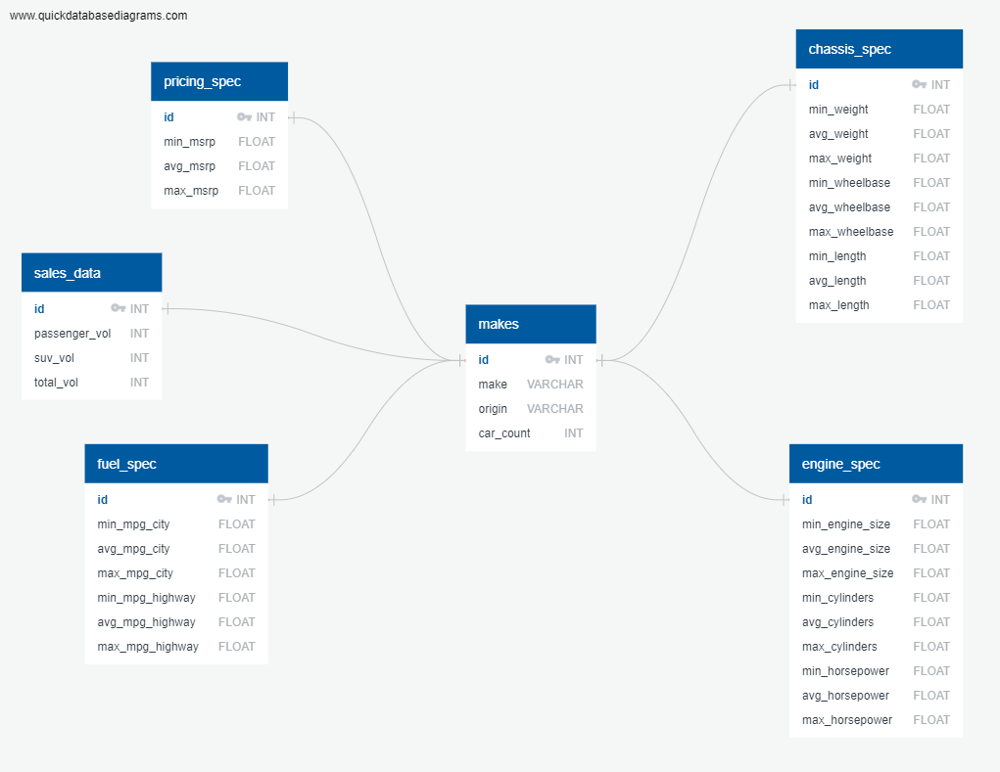

# Extraction

My Original data sources came from two places
 - [Kaggle cars Data set](https://www.kaggle.com/ljanjughazyan/cars1) as a CSV, referred to as "Kaggle Data Set"
 - [Federal Chambver of Automotive Industries VFACTS](https://www.fcai.com.au/sales/get-vfacts) as a PDF "VFACTS Data Set"

The CSV was well formatted for direct extraction, however the PDF Document was limited, and only a sample from Jan 2012. In order to get this data into the best possible format I manually extracted the aggregate data for each make of car that already existed on pages 14 and 18. I didn't gather the Light Commercial or Heavy Commercial data into the csv as the prospective client for the data would be a car company looking to make a road vehicle for private use and not commercial vehicles.

# Transformation

As the data came exactly as required from the VFACTS Data Set, the only required transformation required was the addition of a sum of the Passenger and SUV vehicle counts

```
final_df['total_vol'] = final_df[['Passenger_Volume','SUV_Volume']].sum(axis=1)
```

As for the Kaggle Data Set, firstly the Drive Train column was dropped, the Invoice column was dropped as the MSRP gives a better indication of the market from the point of view of a manufacturer, and the Type column was dropped as it is a duplicate of the car types we encounter in the VFACTS Data Set. 
```
cols = ['Make','Origin','MSRP','EngineSize','Cylinders','Horsepower','MPG_City','MPG_Highway','Weight','Wheelbase','Length']
kdf = kdf[cols]
```
The MSRP column was then converted from a string with currency symbols, into an float so that math functions can be applied to it. This was done using a function and then using the .apply() function on the table column

```
def clean_currency(x):
    """ If the value is a string, then remove currency symbol and delimiters
    otherwise, the value is numeric and can be converted
    """
    if isinstance(x, str):
        return(x.replace('$', '').replace(',', ''))
    return(x)

kdf['MSRP'] = kdf['MSRP'].apply(clean_currency).astype('float')
```

Next, an aggregation of each make's cars was created in order to get a more understandable data set for the client rather than searching through hundreds of car models to get the information. Each of the columns regarding the car information was aggregated by the Minimum value, Mean Value, and the Maximum Value. This will allow an overview of the market and where each make stands, and can be easily graphed out.

```
agg_cols = ['Origin','MSRP','EngineSize','Cylinders','Horsepower','MPG_City','MPG_Highway','Weight','Wheelbase','Length']
kdf_max = kdf.groupby(['Make']).max()[agg_cols].add_prefix("MAX_")
agg_cols.remove('Origin')
kdf_min = kdf.groupby(['Make']).min()[agg_cols].add_prefix("MIN_")
kdf_avg = kdf.groupby(['Make']).mean()[agg_cols].add_prefix("AVG_")
kdf_agg = kdf_max.join(kdf_min).join(kdf_avg).copy()
kdf_agg['car_count'] = kdf.groupby('Make').count()['Length']
```

Next the two datasets were merged together, with an inner join to drop any empty or null values from either data set, and only include the data that spans across both datasets, an ID was assigned to each make, and the column were given a more appropriate name.

```
final_df = pd.merge(kdf_agg,vdf,on="Make",how="inner")
```

```
rename_dict = {
    'Make':'make',
    'MAX_Origin':'origin',
    'MAX_MSRP':'max_msrp',
    'MAX_EngineSize':'max_engine_size',
    'MAX_Cylinders':'max_cylinders',
    'MAX_Horsepower':'max_horsepower',
    'MAX_MPG_City':'max_mpg_city',
    'MAX_MPG_Highway':'max_mpg_highway',
    'MAX_Weight':'max_weight',
    'MAX_Wheelbase':'max_wheelbase',
    'MAX_Length':'max_length',
    'MIN_MSRP':'min_msrp',
    'MIN_EngineSize':'min_engine_size',
    'MIN_Cylinders':'min_cylinders',
    'MIN_Horsepower':'min_horsepower',
    'MIN_MPG_City':'min_mpg_city',
    'MIN_MPG_Highway':'min_mpg_highway',
    'MIN_Weight':'min_weight',
    'MIN_Wheelbase':'min_wheelbase',
    'MIN_Length':'min_length',
    'AVG_MSRP':'avg_msrp',
    'AVG_EngineSize':'avg_engine_size',
    'AVG_Cylinders':'avg_cylinders',
    'AVG_Horsepower':'avg_horsepower',
    'AVG_MPG_City':'avg_mpg_city',
    'AVG_MPG_Highway':'avg_mpg_highway',
    'AVG_Weight':'avg_weight',
    'AVG_Wheelbase':'avg_wheelbase',
    'AVG_Length':'avg_length',
    'Passenger_Volume':'passenger_vol',
    'SUV_Volume':'suv_vol'}
final_df.rename(columns=rename_dict,inplace=True)
```

# Load

A postgresql was chosen for this project as the data is already strongly structured and wont need to be edited beyond the initial loading, and any new data that may need to be added can be added as a new table, as the data has been broken down into categories. The tables each tell their own story for the data, with different specifications in each table, which can be queried by the client to get a different picture.
The generated make ID number is used as the primary key in all tables as there will always be a 1 to 1 relationship between the tables. The aggregation columns have all been loaded in as floats, as the averages should all be seen as floats, and having consistency over the data-types for each field will allow for additional math to be done on the data without the need of converting between data types.

The process used for the loading stage was to create the postgresql database that was based on the [ERD](ERD.schema) generated using the query found [here](create_table_queries.sql)




Next the Data was loaded in via the notebook by creating a list for each table containing the column names

```
make_sql_list = ['id','make','origin','car_count']
pricing_spec_list = ['id','min_msrp','avg_msrp','max_msrp']
engine_spec_list = ['id','min_engine_size','avg_engine_size','max_engine_size','min_cylinders','avg_cylinders','max_cylinders','min_horsepower','avg_horsepower','max_horsepower']
fuel_spec_list = ['id','min_mpg_city','avg_mpg_city','max_mpg_city','min_mpg_highway','avg_mpg_highway','max_mpg_highway']
chassis_spec_list = ['id','min_weight','avg_weight','max_weight','min_wheelbase','avg_wheelbase','max_wheelbase','min_length','avg_length','max_length']
sales_data_list = ['id','passenger_vol','suv_vol','total_vol']
```

Then using each of the lists to write the columns into the appropriate table in postgreSQL

```
final_df[pricing_spec_list].to_sql(name='pricing_spec',con=engine,if_exists='append',index=False)
final_df[engine_spec_list].to_sql(name='engine_spec',con=engine,if_exists='append',index=False)
final_df[fuel_spec_list].to_sql(name='fuel_spec',con=engine,if_exists='append',index=False)
final_df[chassis_spec_list].to_sql(name='chassis_spec',con=engine,if_exists='append',index=False)
final_df[sales_data_list].to_sql(name='sales_data',con=engine,if_exists='append',index=False)
```

The Following query can then be used to display all the data in pgAdmin

```
SELECT m.id,m.make,m.origin,m.car_count,s.total_vol,c.min_weight,c.avg_weight,c.max_weight,c.min_wheelbase,c.avg_wheelbase,c.max_wheelbase,c.min_length,c.avg_length,c.max_length,e.min_engine_size,e.avg_engine_size,e.max_engine_size,e.min_cylinders,e.avg_cylinders,e.max_cylinders,e.min_horsepower,e.avg_horsepower,e.max_horsepower,f.min_mpg_city,f.avg_mpg_city,f.max_mpg_city,f.min_mpg_highway,f.avg_mpg_highway,f.max_mpg_highway,p.min_msrp,p.avg_msrp,p.max_msrp
FROM makes as m
JOIN sales_data as s
ON m.id = s.id
JOIN chassis_spec as c
ON m.id = c.id
JOIN engine_spec as e
ON m.id = e.id
JOIN fuel_spec as f
ON m.id=f.id
JOIN pricing_spec as p
ON m.id = p.id
```

Screenshot of a snippit of the pgAdmin screen with the query from above


